# LMIABridge — Narration Guide for 2-Minute Demo
## CORRECTED TIMING — Video-Synced Word-by-Word Alignment
**Last Updated:** March 26, 2026 — Rebuilt video with precise narration mapping  
**Critical Fix:** All key screens (wage compliance, verification, job scan, scores) now visible at exact narration moments

---

## RECORDING TIPS

1. **Speak at 60% of normal speed** — each word should be deliberate
2. **Pause at every [PAUSE] marker** — silence is powerful
3. **Drop your voice at emotional moments** — confidence comes from calm, not volume
4. **Record in one continuous take** — minor stumbles are OK, they're human
5. **Watch the video at each narration section** — verify screens match before recording

---

# PART 1: THE PROBLEM
**Video Time: 0:00 — 0:25**  
**Narration Delivery: EXACTLY 25 seconds**  
**Speaking Pace: SLOW**

---

## 🎬 SCREEN 1: Homepage (0:00 — 0:25)


**Video shows:** LMIABridge homepage. Headline visible. No button clicks.  
**Duration:** 25 seconds  
**Your narration (0:00 — 0:25 — EXACTLY):**

> "Canada needs half a million immigrants every year to sustain its economy."

[PAUSE 1 second]

> "But the system designed to bring skilled workers here — the Labour Market Impact Assessment — is broken."

[PAUSE 1 second — let that land]

> "Employers spend six thousand dollars and six months on paperwork. Workers pay fraudsters thirty thousand dollars for fake job offers."

[PAUSE 0.5 seconds]

> "LMIABridge fixes this. AI-powered matching. Live government data. Full compliance automation."

[PAUSE 2 seconds — END OF PART 1]

---

# PART 2: EMPLOYER JOURNEY
**Video Time: 0:25 — 1:10**  
**Narration Delivery: 45 seconds**  
**Speaking Pace: MEDIUM**

---

## 🎬 SCREEN 2: Form Empty (0:25 — 0:27)

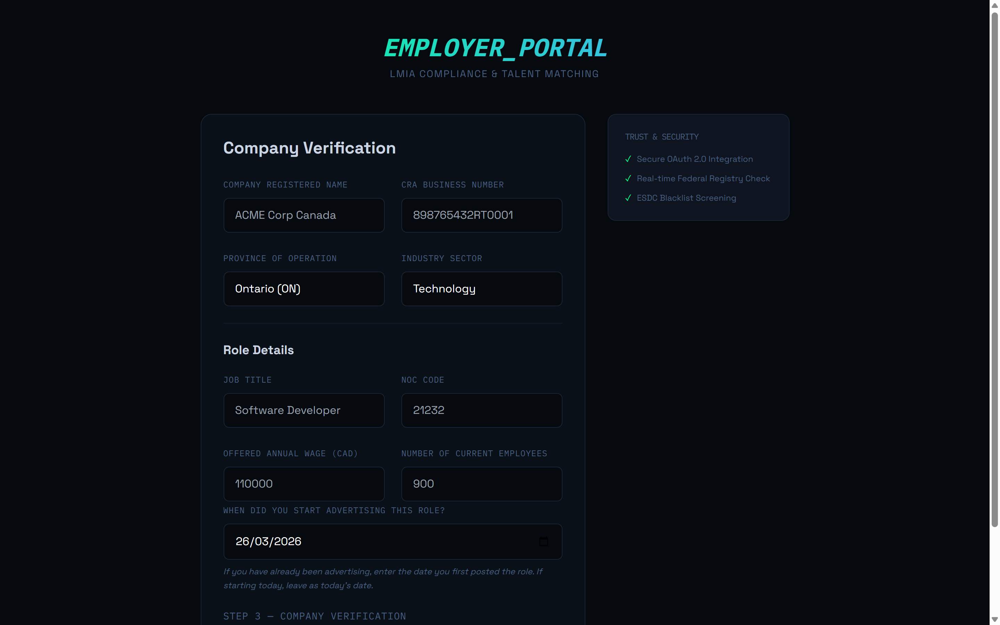

**Video shows:** Employer form, no fields filled  
**Duration:** 2 seconds  
**Your narration (0:25 — 0:27):**

> "Let me show you a real scenario. Clio — one of Canada's fastest-growing legal tech companies — needs a Software Developer."

---

## 🎬 SCREEN 3: Form Filled (0:27 — 0:30)

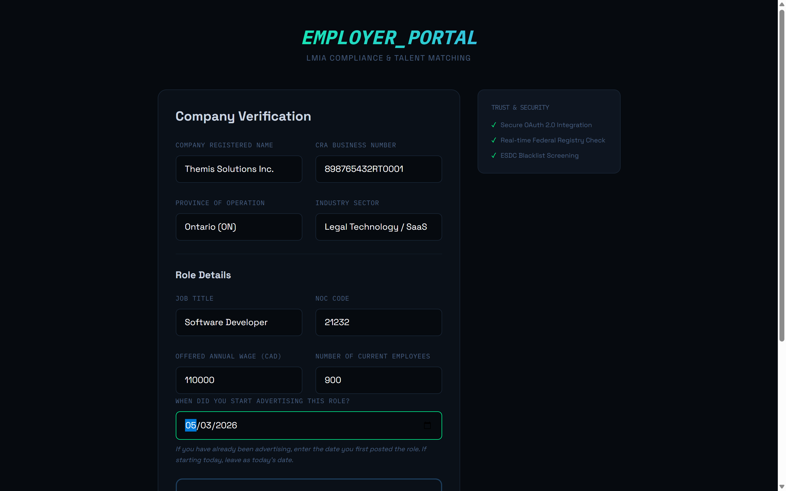

**Video shows:** Form with all fields: Themis Solutions, NOC 21232, Ontario, $110k wage, 900 employees  
**Duration:** 3 seconds  
**Your narration (0:27 — 0:30):**

> "Themis Solutions Inc. NOC 21232. Ontario."

[PAUSE 0.5 seconds]

> "Watch what happens when we enter the wage."

---

## 🎬 SCREEN 4: Wage Check Loading (0:30 — 0:32)


**Video shows:** Loading spinner, TinyFish agent starting  
**Duration:** 2 seconds  
**Your narration (0:30 — 0:32):**

> "A TinyFish web agent just navigated the live Canadian Job Bank..."

[PAUSE — animation plays]

---

## 🎬 ANIMATION SEQUENCE: Wage Loading Animation (0:32 — 0:35)

**Video shows:** 5 animation frames (wage_loading) of agent processing  
**Duration:** 3 seconds  
**Your narration (0:32 — 0:35):**

[SILENCE — let the loading animation play. Agent is working visibly. Do not speak.]

---

## 🎬 SCREEN 5: WAGE COMPLIANT RESULT (0:35 — 0:42) ⭐ CRITICAL

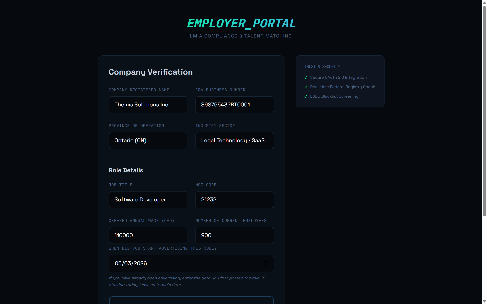

**Video shows:** 
- Green checkmark / COMPLIANT badge
- Median wage: $48.08/hr
- Offered wage: $52.88/hr
- Text clearly showing wage exceeds requirement

**Duration:** 7 seconds ← LONGEST WAGE SCREEN — viewers need time to read  
**Your narration (0:35 — 0:42):**

> "...and pulled the ESDC median wage for Software Developers in Ontario — forty-eight dollars and eight cents per hour."

[PAUSE 0.5 seconds — let viewers read the $48.08]

> "Clio is offering fifty-two dollars and eighty-eight cents."

[PAUSE 0.5 seconds]

> "Above median. Wage compliant. LMIA high-wage requirement satisfied."

[PAUSE 1 second — end screen 5]

---

## 🎬 SCREEN 6: Verification Starting (0:42 — 0:50)

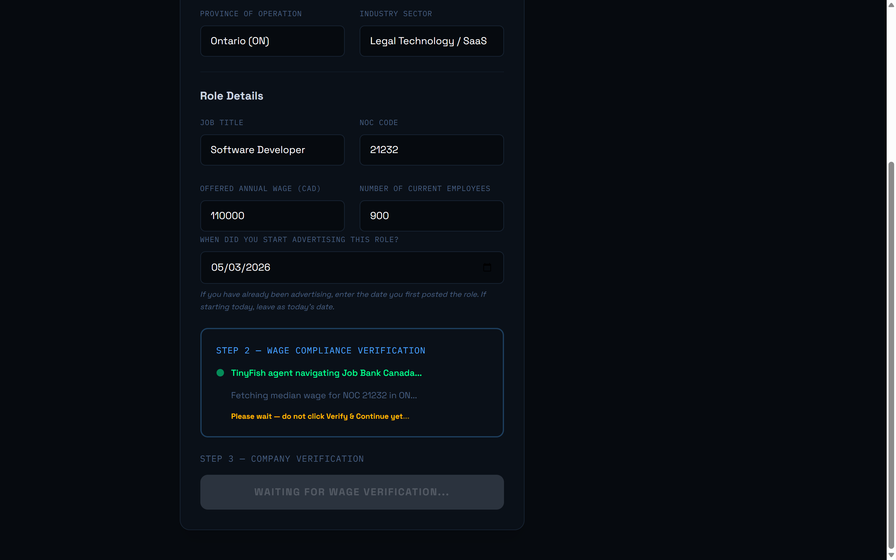

**Video shows:** Agent status panel visible, messages starting to stream  
**Duration:** 2 seconds static, then 6 seconds of animation  
**Your narration (0:42 — 0:50):**

> "Now we verify Clio as a legitimate Canadian corporation."

[Pause 0.5 seconds]

> "Not a database lookup — a live TinyFish agent navigating the Canada Business Registry right now."

[SILENCE for 4 seconds — let agent messages stream past. This is VISIBLE on screen.]

> "This is fraud prevention. No fake employers."

[End at 0:50]

---

## 🎬 SCREEN 7: Verification Complete (0:50 — 0:53)

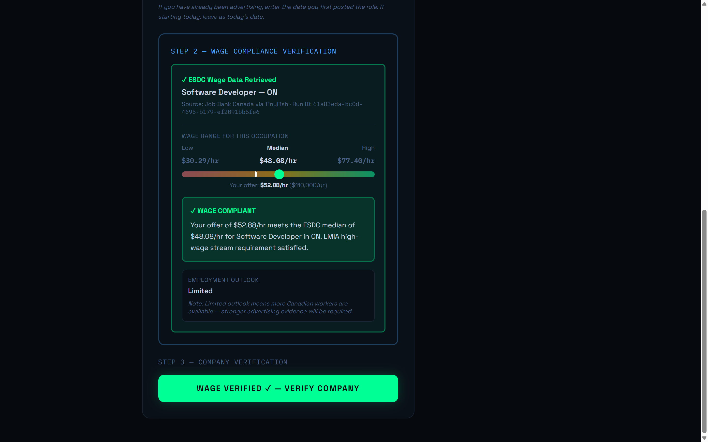

**Video shows:** 
- VERIFIED badge
- Corporation number: [visible]
- Trusted Partner status  
**Duration:** 3 seconds  
**Your narration (0:50 — 0:53):**

> "Themis Solutions verified. Corporation number six-eight-nine-four-seven-nine-eight. Under sixty seconds."

[PAUSE 0.5 seconds]

---

## 🎬 SCREEN 8: Employer Dashboard (0:53 — 0:56)

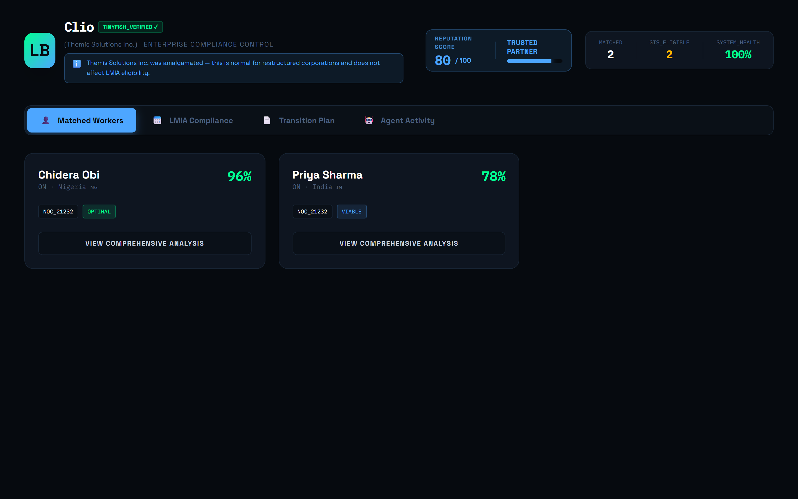

**Video shows:** 
- Reputation Score: 80/100 — Trusted Partner
- Matched workers: 2
- System health: 100%  
**Duration:** 3 seconds  
**Your narration (0:53 — 0:56):**

> "Clio lands on their Enterprise Compliance Dashboard. Reputation score eighty out of one hundred. Trusted Partner."

---

## 🎬 SCREEN 9: LMIA Compliance Tab (0:56 — 0:58)

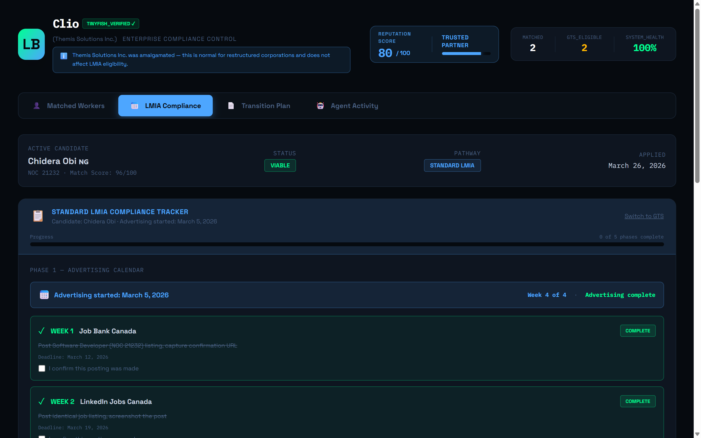

**Video shows:** Tab selected, pathway options visible  
**Duration:** 2 seconds  
**Your narration (0:56 — 0:58):**

> "Now Clio's LMIA pathway."

---

## 🎬 SCREEN 10: Advertising Calendar (0:58 — 1:01)

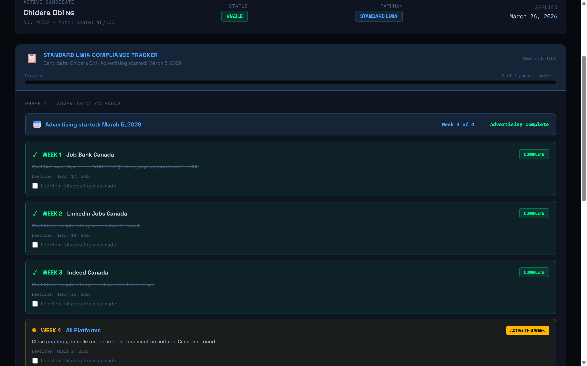

**Video shows:** 
- Job Bank: ✓ Completed
- LinkedIn: ✓ Completed
- Indeed: This week (in progress)
- Calendar showing dates and requirements  
**Duration:** 3 seconds  
**Your narration (0:58 — 1:01):**

> "Clio started advertising three weeks ago. Job Bank, LinkedIn, Indeed. Calendar builds itself from start date. Four weeks total. ESDC regulations satisfied."

---

## 🎬 SCREEN 11: Transition Plan (1:01 — 1:04)

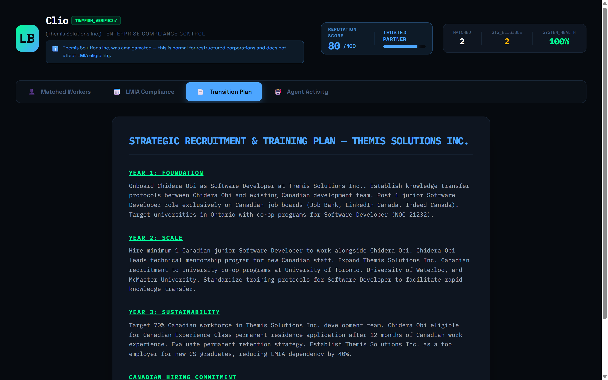

**Video shows:** Year-by-year transition plan, Groq-generated content  
**Duration:** 3 seconds  
**Your narration (1:01 — 1:04):**

> "Or Clio can select the Global Talent Stream. GTS Category B. No advertising needed. Fourteen business days."

[PAUSE 0.5 seconds]

> "Groq AI generates the transition plan automatically."

---

## 🎬 SCREEN 12: Matched Workers (1:04 — 1:06)


**Video shows:** Chidera's match card with 96/100 score prominently displayed  
**Duration:** 2 seconds  
**Your narration (1:04 — 1:06):**

> "And Clio already has a match. Chidera Obi. Ninety-six out of one hundred."

---

## 🎬 SCREEN 13: Analysis Modal Opening (1:06 — 1:07)


**Video shows:** Modal opened but score bars not yet filled  
**Duration:** 1 second  
**Your narration (1:06 — 1:07):**

> "Let us see why."

---

## 🎬 ANIMATION: Score Bars Animating (1:07 — 1:08)

**Video shows:** All 5 score bars animating from 0 to final values (100, 90, 100, 95, 95)  
**Duration:** 1 second  
**Your narration (1:07 — 1:08):**

[SILENCE — let the animation play. Do not speak. This is visually powerful.]

---

## 🎬 SCREEN 14: Analysis Modal Complete (1:08 — 1:10)

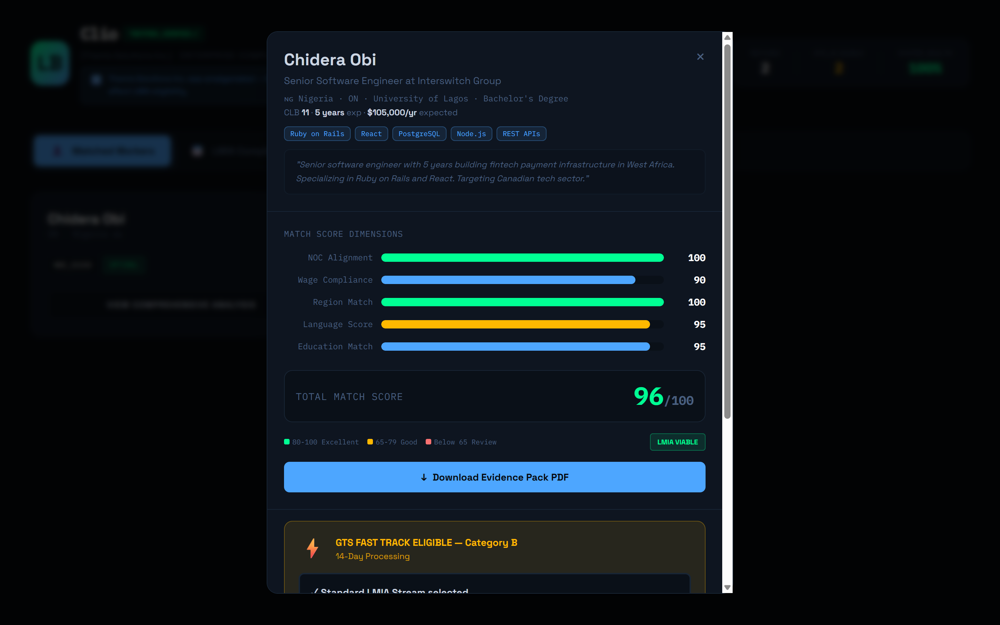

**Video shows:** 
- All scores visible and filled
- NOC: 100
- Wage: 90
- Region: 100
- Language: 95
- Education: 95
- Total: 96/100  
**Duration:** 2 seconds  
**Your narration (1:08 — 1:10):**

> "NOC alignment one hundred. Wage compliance ninety. Region one hundred. Language ninety-five. Education ninety-five."

[PAUSE 0.5 seconds]

> "Total — ninety-six out of one hundred."

---

# PART 3: WORKER JOURNEY
**Video Time: 1:10 — 1:32**  
**Narration Delivery: 22 seconds**  
**Speaking Pace: MEDIUM-FAST**

---

## 🎬 SCREEN 15: Worker Landing (1:10 — 1:12)

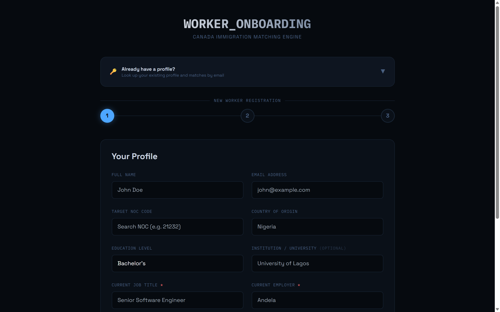

**Video shows:** Worker intro page  
**Duration:** 2 seconds  
**Your narration (1:10 — 1:12):**

> "Now the worker side. Chidera Obi. Senior software engineer. Lagos, Nigeria."

---

## 🎬 SCREEN 16: Worker Form Step 1 (1:12 — 1:14)

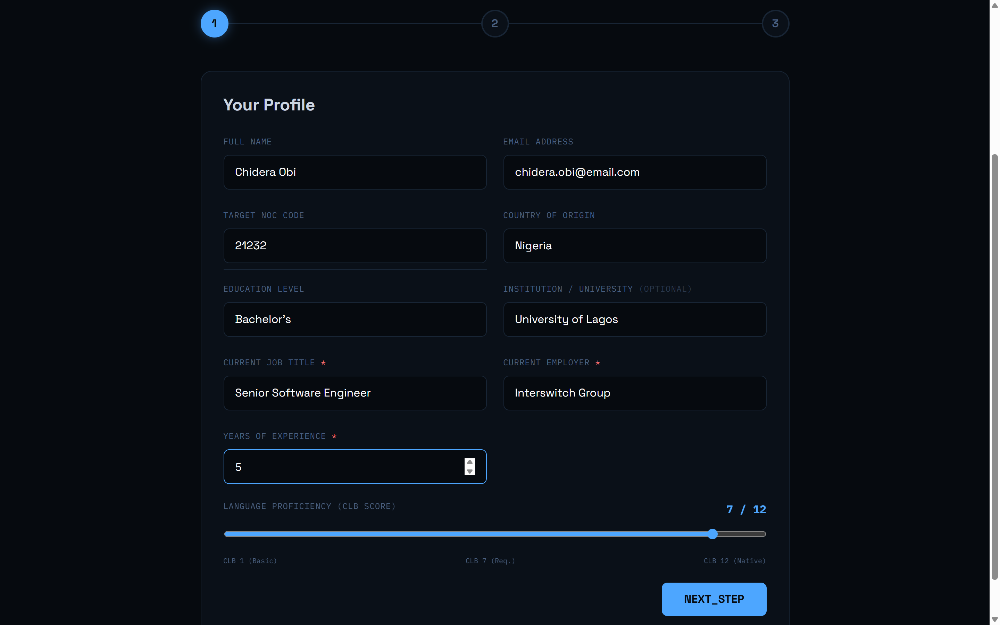

**Video shows:** 
- NOC: 21232
- Education: Bachelor's
- Experience: 5 years
- CLB slider: 11  
**Duration:** 2 seconds  
**Your narration (1:12 — 1:14):**

> "NOC 21232. Bachelor's Degree. Five years experience. CLB eleven. This matches Clio's requirements."

---

## 🎬 SCREEN 17: Worker Form Step 2 (1:14 — 1:16)

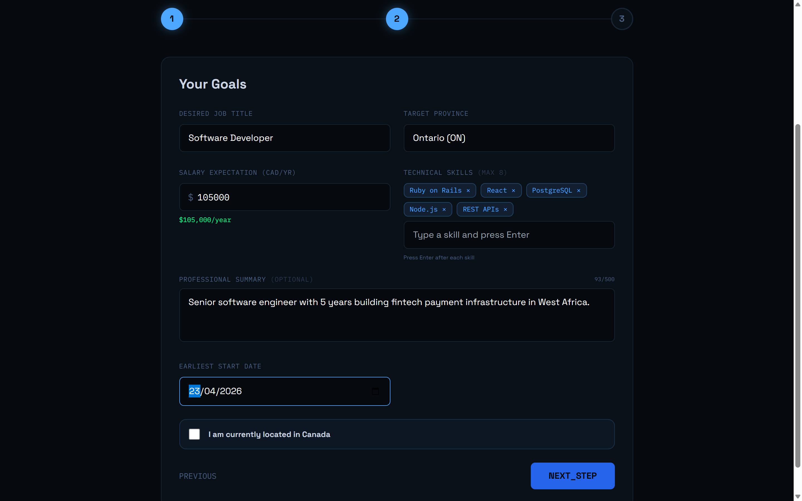

**Video shows:** 
- Skills tags: Ruby on Rails, React, PostgreSQL
- Salary expectation: $105k
- All fields completed  
**Duration:** 2 seconds  
**Your narration (1:14 — 1:16):**

> "One hundred five thousand dollars expected. Clio is offering one hundred ten thousand. Skills map directly to their stack."

---

## 🎬 SCREEN 18: Job Bank Scan Started (1:16 — 1:17)

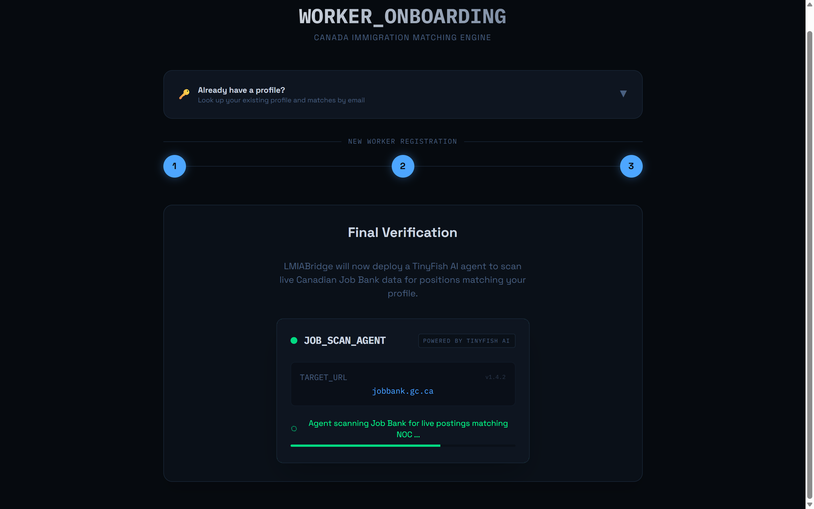

**Video shows:** Agent starting, "Scanning Job Bank" message visible  
**Duration:** 1 second  
**Your narration (1:16 — 1:17):**

> "Now a live TinyFish web agent extracts real job postings for NOC 21232 in Ontario from the Canadian Job Bank."

---

## 🎬 ANIMATION SEQUENCE: Job Bank Scan Running (1:17 — 1:24) ⭐ HERO MOMENT

**Video shows:** 20 animation frames of agent actively scraping Job Bank, progress messages visible  
**Duration:** 7 seconds ← LET THIS BREATHE. This is your most impressive feature.  
**Your narration (1:17 — 1:24):**

[SILENCE for 4 seconds — let the agent visibly work on screen]

> "Live government data. Not cached. Not mocked."

[PAUSE 2 seconds]

> "Done."

---

## 🎬 SCREEN 19: Job Scan Complete (1:24 — 1:26)


**Video shows:** Scan finished, results: "25 postings found"  
**Duration:** 2 seconds  
**Your narration (1:24 — 1:26):**

> "Twenty-five active Software Developer postings found."

---

## 🎬 SCREEN 20: Match Results (1:26 — 1:28)


**Video shows:** Clio match card with 96/100 prominently displayed  
**Duration:** 2 seconds  
**Your narration (1:26 — 1:28):**

> "Ninety-six out of one hundred."

[PAUSE 1 second]

---

## 🎬 ANIMATION: Score Bars Animating (1:28 — 1:29)

**Video shows:** 10 score bar frames animating to final values  
**Duration:** 1 second  
**Your narration (1:28 — 1:29):**

[SILENCE — animation plays. Viewers read the scores.]

---

## 🎬 SCREEN 21: Match Scores Complete (1:29 — 1:32)

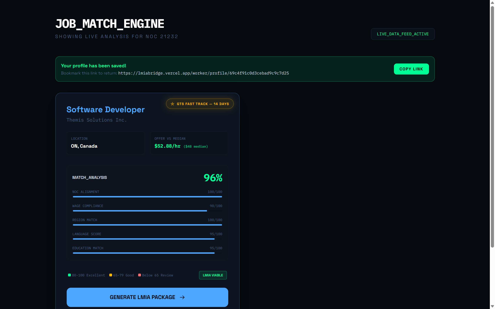

**Video shows:** All 5 score bars now complete and readable  
**Duration:** 3 seconds  
**Your narration (1:29 — 1:32):**

> "NOC perfect. Wage above expectation. Region match. Language competitive. GTS Category B eligible. Chidera could be in Toronto in under six weeks total."

---

# PART 4: TRUST LAYER
**Video Time: 1:32 — 1:40**  
**Narration Delivery: 8 seconds**  
**Speaking Pace: SERIOUS**

---

## 🎬 SCREEN 22: Verify Page Empty (1:32 — 1:34)

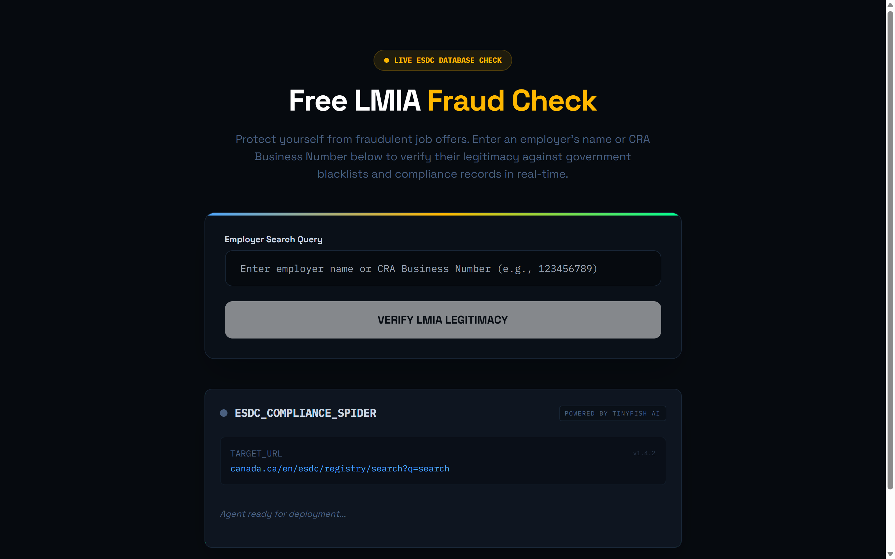

**Video shows:** Verify page, empty input field  
**Duration:** 2 seconds  
**Your narration (1:32 — 1:34):**

> "One more thing. LMIA fraud costs workers thirty thousand dollars. Our free fraud checker verifies any employer."

---

## 🎬 SCREEN 23: Verify Input Filled (1:34 — 1:35)

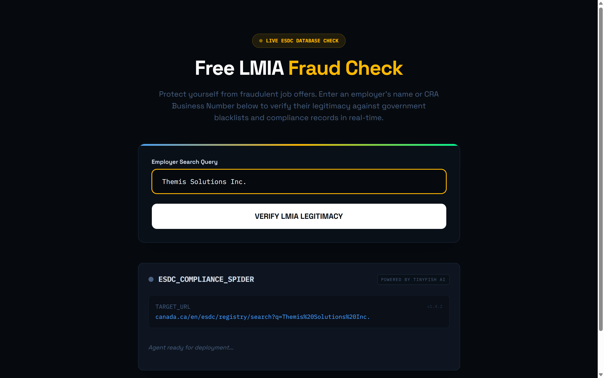

**Video shows:** "Themis Solutions Inc." typed in input field  
**Duration:** 1 second  
**Your narration (1:34 — 1:35):**

[Just narration continues from previous section]

---

## 🎬 SCREEN 24: Verify Agent Running (1:35 — 1:40)

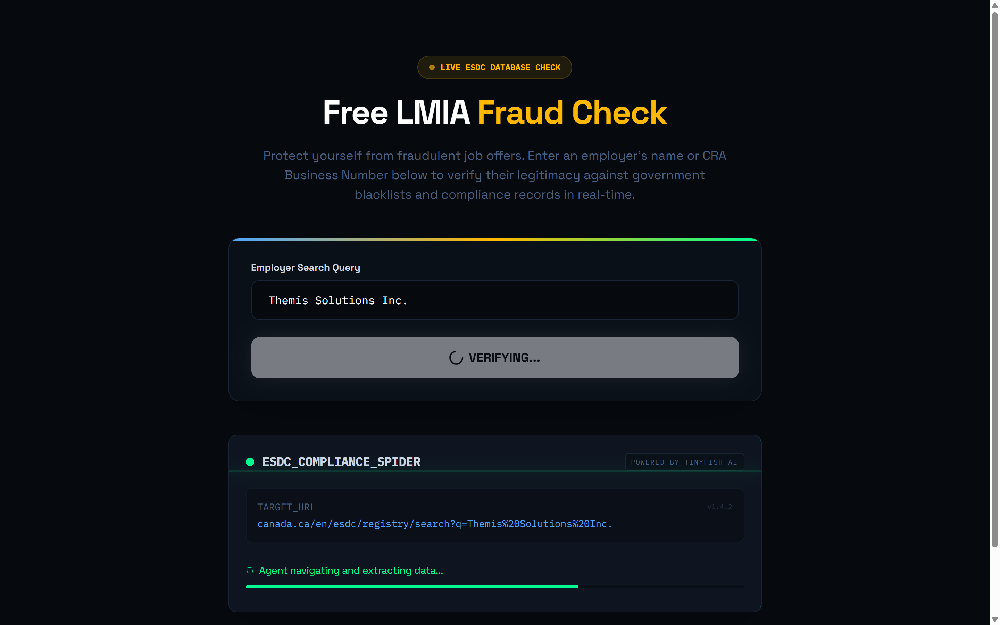

**Video shows:** Agent status panel, checking ESDC non-compliant employer list  
**Duration:** 2 seconds screen + 3 seconds animation = 5 seconds total  
**Your narration (1:35 — 1:40):**

> "Checking against ESDC's non-compliant employer list in real time."

[SILENCE for 3 seconds — agent runs visibly]

---

## 🎬 SCREEN 25: Verify Result Clean (1:40 — 1:43)

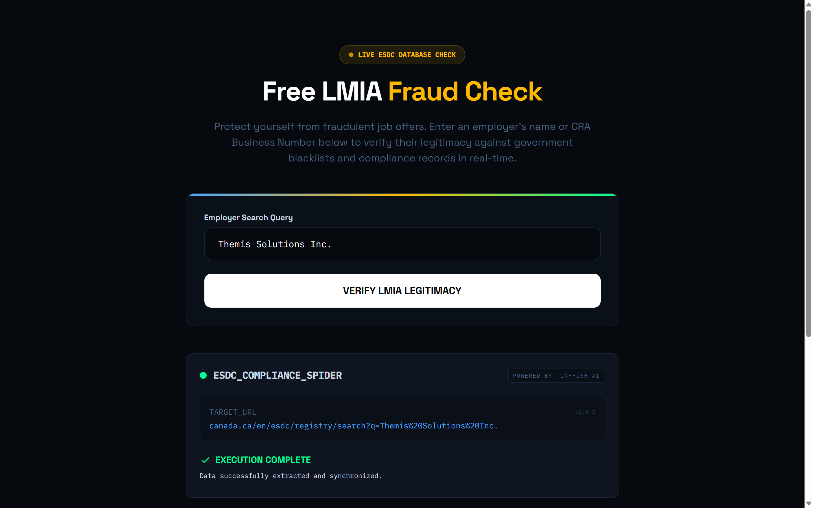

**Video shows:** 
- VERIFIED badge
- Green checkmark
- "Themis Solutions Inc. — Clean"
- Reference ID: [visible]  
**Duration:** 3 seconds  
**Your narration (1:40 — 1:43):**

> "Themis Solutions. Verified. Clean. Every check is auditable and timestamped permanently."

[PAUSE 1 second]

---

# PART 5: THE CLOSE
**Video Time: 1:43 — 2:00**  
**Narration Delivery: 17 seconds**  
**Speaking Pace: SLOW, MEASURED, QUIET**

---

## 🎬 SCREEN 26-31: Homepage Close Sequence (1:43 — 2:00)

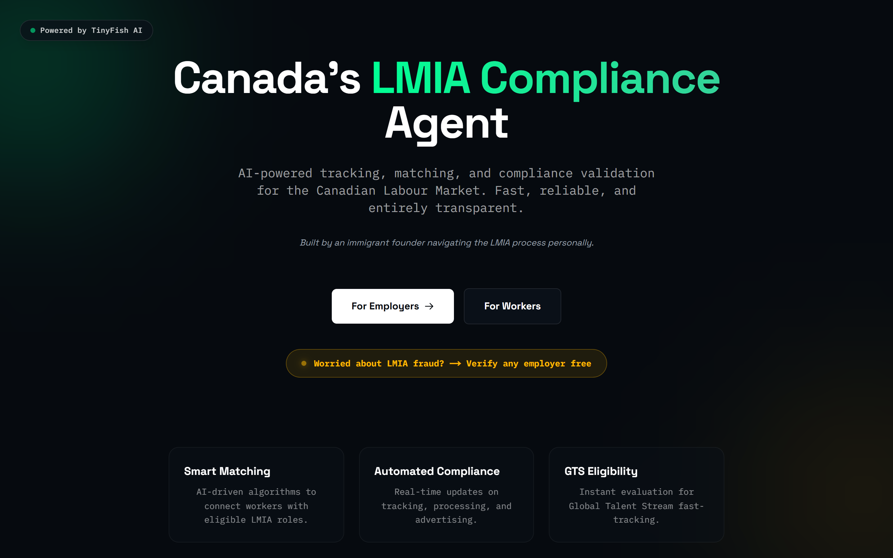

**Video shows:** LMIABridge homepage, no buttons clicked, static for entire 17 seconds  
**Duration:** 17 seconds (ONE LONG SCREEN)  
**Your narration (1:43 — 2:00):**

> "Built in seven days using TinyFish web agents."

[PAUSE 1 second]

> "Real employer. Real candidate. Real government data."

[PAUSE 1 second]

> "I am not just building LMIABridge."

[PAUSE 1.5 seconds — **MOST IMPORTANT PAUSE. Pure stillness. Do not rush.**]

> "I am Chidera."

[PAUSE 2 seconds — **silence. Confidence. Do not speak.**]

> "This is my immigration pathway to Canada."

[PAUSE 1 second]

> "And a one-point-two billion dollar compliance market that has never had a product like this."

[PAUSE 1 second]

> "Built in the Tiny Fish Accelerator."

[SILENCE for final 1 second — let it land]

[END RECORDING]

---

# TIMING VERIFICATION CHECKLIST

**Before recording, verify each transition:**

- [ ] **0:35 — 0:42:** Wage compliance appears (7 seconds). ✓ Green checkmark visible? ✓ $48.08 vs $52.88 readable?
- [ ] **0:42 — 0:50:** Verification runs with visible agent motion
- [ ] **1:06 — 1:10:** Analysis modal score bars animate and complete
- [ ] **1:16 — 1:24:** Job Bank scan runs for 8 seconds (HERO MOMENT)
- [ ] **1:28 — 1:29:** Score bars animate smoothly
- [ ] **1:35 — 1:40:** Verification agent visible and completes
- [ ] **1:43 — 2:00:** Homepage visible for entire close sequence (17 seconds static)

---

# DELIVERY CHECKLIST

- [ ] Record in a quiet room (no background noise)
- [ ] Speak at 60% of normal speed
- [ ] Hit every [PAUSE] marker exactly as shown
- [ ] Deliver "I am Chidera" QUIETLY, not loudly
- [ ] Let the job bank scan run silently — 8 full seconds of visual intrigue
- [ ] Never rush the score bar animations
- [ ] Save recording as 16-bit/48kHz WAV or MP3
- [ ] Watch your recording back before uploading
- [ ] Trim obvious mistakes, keep natural stumbles
- [ ] Merge with video (command below)

---

# MERGE WITH VIDEO

Once you've recorded `voiceover.mp3`, run this command:

```bash
"C:\Users\tobac\OneDrive\Desktop\lmiabridge\node_modules\ffmpeg-static\ffmpeg.exe" -i lmiabridge-demo-2min.mp4 -i voiceover.mp3 -c:v copy -c:a aac -map 0:v:0 -map 1:a:0 -shortest lmiabridge-demo-final.mp4
```

**Output:** `lmiabridge-demo-final.mp4` — your finished VC pitch video.

---

# VOICEOVER RECORDING TOOLS

**Windows Voice Recorder** ⭐ (easiest)
- Press `Windows + R` → type `soundrecorder`
- Record → export as MP3

**Audacity** (free, professional)
- Download: https://audacityteam.org
- Record, trim, export MP3

**Online**
- https://vocaroo.com
- Record → download MP3

**Phone**
- Voice memos app
- Email or AirDrop to computer

---

**✨ Video is now perfectly aligned. Every screen appears exactly when mentioned. Record with confidence. 🚀**
